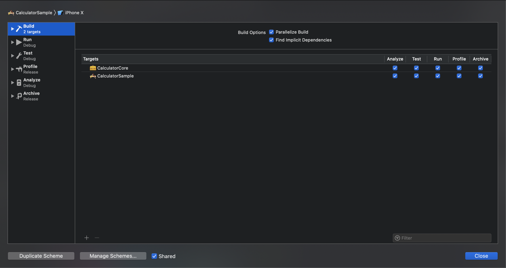
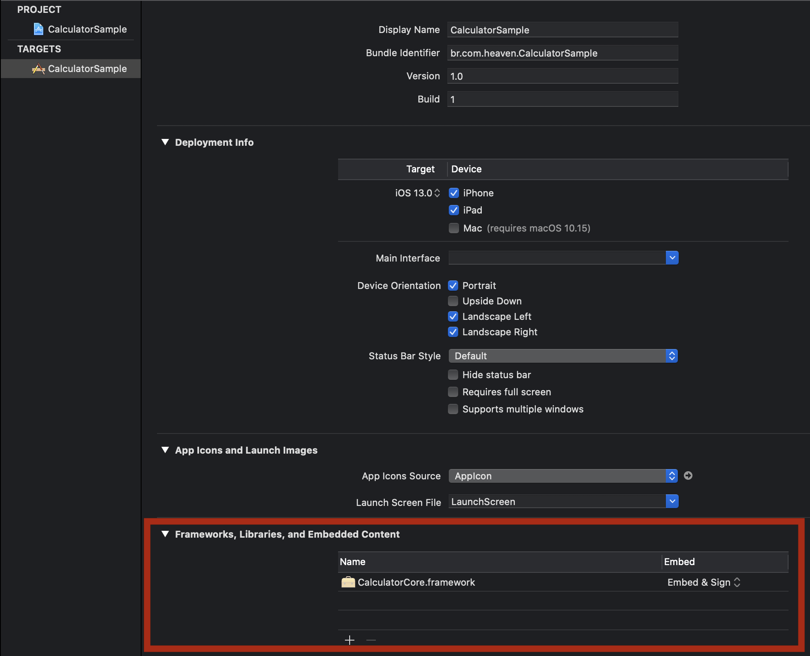

## Modularização mono-repositório (aproximação por projetos)

### Passos

1. Crie um workspace 

Para criar o workspace manualmente, siga esse [tutorial](https://www.dev2qa.com/how-to-create-xcode-workspace-and-add-new-exist-project-into-it/). Alternativamente, você pode usar o workspace criado pelo CocoaPods.

2. Separe em projetos que cumpram a função de cada módulo dentro do workspace.

Para este projeto, foi separado entre Core (módulo que programa a função da Calculadora) e o Sample (o programa que utiliza o módulo e expõe os dados). Os módulos que computam dados devem ser frameworks, enquanto àqueles que operam entrada e saída de dados devem ser aplicação.

3. Altere o controle de acesso das classes nos módulos para que somente o necessário para cumprir sua função seja exposto.

Em caso de dúvida sobre controle de acesso, leia essa [documentação](https://docs.swift.org/swift-book/LanguageGuide/AccessControl.html).

4. A relação de dependencia deve ser ajustada pelas configurações do projeto integrado.

No caso desse projeto, eu adicionei a build do Core para acontecer antes do Sample, assim sempre que o Sample for buildado também será o Core.

Também embuti o framework da Core no Sample, para fazer essa framework ser acessível pela aplicação.

5. Importe a framework nas classes onde for necessário e pronto! Está fazendo uso do seu módulo completamente independente.

6. Lembre-se. Processos de qualidade deve ser alocados no módulo correspondente à responsabilidade. No caso deste projeto, os testes unitários da calculadoras estão inclusos dentro do módulo Core, enquanto todos os testes de integração devem estar alocados no Sample.